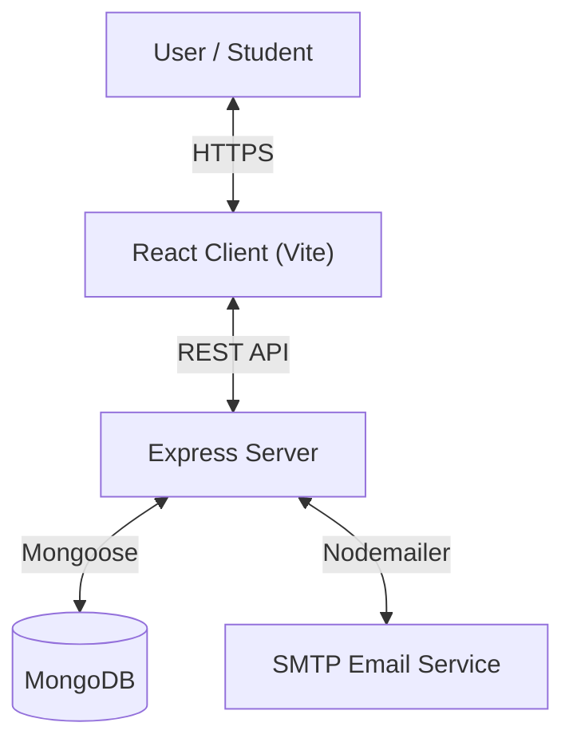

# 🎓 Yenepoya Student Hub

> **A Premium Student Portal for Academic Management, Digital Identity, and Campus Services.**


## 📖 About The Project

The **Yenepoya Student Hub** is a modern, responsive web application designed to centralize student campus life. Built with a "SaaS-first" design philosophy, it moves away from traditional, clunky academic portals to offer a sleek, dark-mode enabled, and highly interactive user experience.

Students can manage their profile, access digital identification, request official documents, order university merchandise, and stay updated with campus broadcasts—all from a single "Command Center."

## 🏗️ Architecture

The project follows a **Monorepo-style MERN Architecture**:

- **Client (`/client`)**: A React.js Single Page Application (SPA) built with Vite. It consumes the REST API and handles all UI/UX.
- **Server (`/server`)**: A Node.js/Express REST API that manages business logic, database connections, and authentication.
- **Database**: MongoDB (NoSQL) for flexible data storage.



## ✨ Key Features

### 🔐 Authentication Suite
*   **Secure Login/Signup**: JWT-based authentication with cookie storage.
*   **OTP Verification**: Email-based verification using a custom HTML template.
*   **Forgot Password**: Secure reset flow.

### 📊 Student Dashboard
*   **Command Center UI**: A central hub showing current term status, quick actions, and welcome stats.
*   **Notification Integration**: Real-time alerts for document approvals and order updates.
*   **Dark Mode**: Fully supported system-wide dark theme.

### 🆔 Digital Identity
*   **Virtual ID Card**: A 3D-flippable digital ID card with holographic animation.
*   **Live QR Code**: Generates a valid QR code for library/campus access.
*   **Offline Mode**: Designed to look good even on mobile screens.

### 🛍️ Campus Store
*   **Merchandise Portal**: A complete e-commerce flow for uniforms and gear.
*   **Cart System**: Add to cart, manage quantities, and "checkout".
*   **Order Tracking**: Track the status of requests.

### 📄 Administrative Services
*   **Document Requests**: Request Bonafide certificates, transcripts, etc.
*   **Admin Dashboard**: (Role-based) Admins can approve/reject requests and manage users.

## 🛠️ Tech Stack

### Frontend (Client)
*   **Framework**: React 18
*   **Build Tool**: Vite
*   **Styling**: TailwindCSS (v3), Framer Motion (Animations), Lucide React (Icons)
*   **State Management**: React Context API
*   **HTTP Client**: Axios

### Backend (Server)
*   **Runtime**: Node.js
*   **Framework**: Express.js
*   **Database**: MongoDB + Mongoose
*   **Authentication**: JSON Web Tokens (JWT), Bcrypt
*   **Email**: Nodemailer

## 🚀 Getting Started

### Prerequisites
*   Node.js (v16 or higher)
*   MongoDB (cloud or local)

### Installation

1.  **Clone the repository**
    ```bash
    git clone https://github.com/your-username/yen-student-hub.git
    cd yen-student-hub
    ```

2.  **Setup Server**
    ```bash
    cd server
    npm install
    # Create .env file with: PORT, MONGO_URI, JWT_SECRET, etc.
    npm start
    ```

3.  **Setup Client**
    ```bash
    cd ../client
    npm install
    # Create .env file with: VITE_API_URL
    npm run dev
    ```

## 📂 Folder Structure

```
yen_e_com/
├── client/                 # Frontend Source
│   ├── src/
│   │   ├── components/     # Reusable UI Components (Navbar, Cards)
│   │   ├── context/        # Global State (Auth, Theme, Cart)
│   │   ├── pages/          # Route Pages (Dashboard, Login, Store)
│   │   └── index.css       # Global Tailwind Styles
│   └── vite.config.js
│
├── server/                 # Backend Source
│   ├── config/             # DB Connection
│   ├── middleware/         # Auth & Admin protection
│   ├── models/             # Mongoose Schemas (User, Order)
│   ├── routes/             # API Endpoints
│   └── index.js            # Server Entry Point
│
└── README.md               # Architecture Documentation
```

---
*Built with ❤️ for Yenepoya University Students.*
